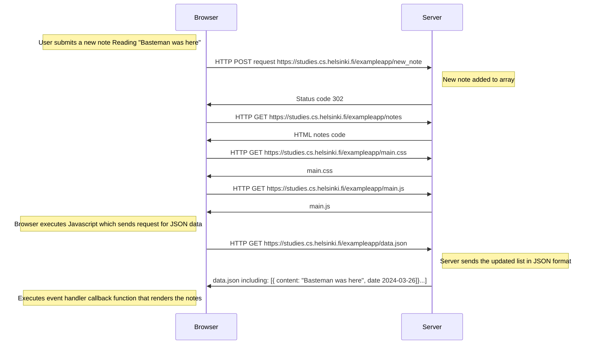

# Exercise 0.4

```mermaid

sequenceDiagram
  Note left of Browser: User submits a new note Reading "Basteman was here"
  Browser ->>Server: HTTP POST request https://studies.cs.helsinki.fi/exampleapp/new_note
  Note right of Server: New note added to array 
  Server ->> Browser: Status code 302
  Browser ->>Server:HTTP GET https://studies.cs.helsinki.fi/exampleapp/notes
  Server ->> Browser: HTML notes code
  Browser ->>Server: HTTP GET https://studies.cs.helsinki.fi/exampleapp/main.css
  Server ->> Browser: main.css
  Browser ->>Server: HTTP GET https://studies.cs.helsinki.fi/exampleapp/main.js
  Server ->> Browser: main.js
  Note left of Browser: Browser executes Javascript which sends request for JSON data
  Browser ->>Server: HTTP GET https://studies.cs.helsinki.fi/exampleapp/data.json
  Note right of Server: Server sends the updated list in JSON format
  Server ->> Browser: data.json including: [{ content: "Basteman was here", date 2024-03-26]}...]
  Note left of Browser: Executes event handler callback function that renders the notes
  
  


```

